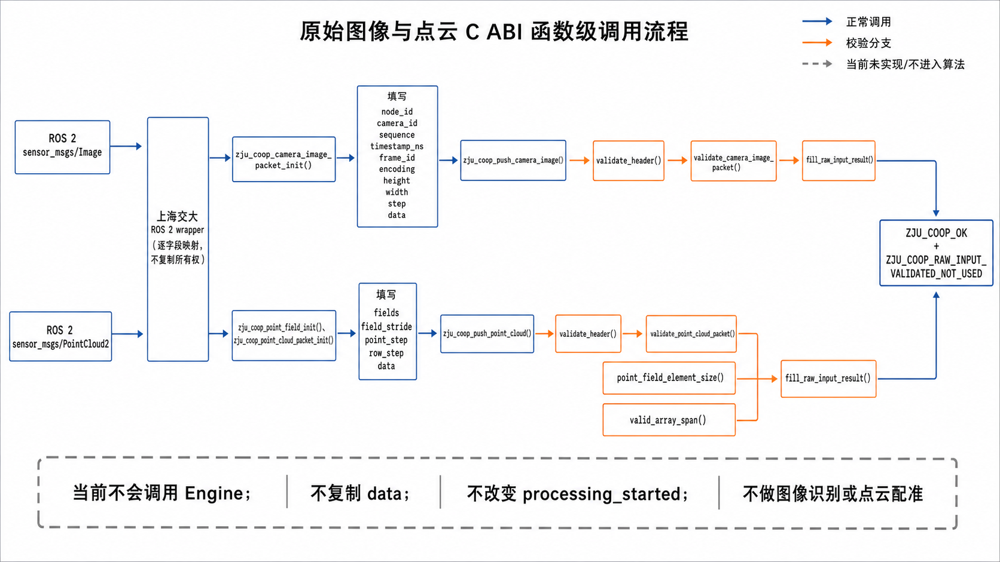
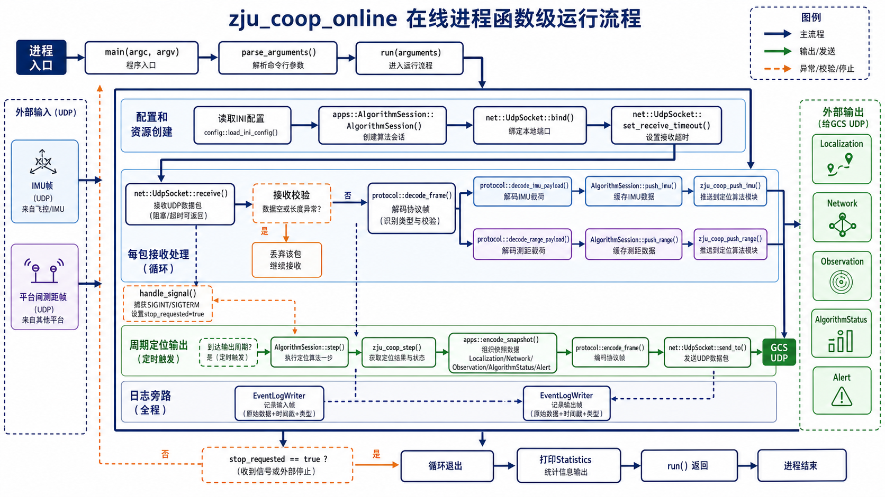
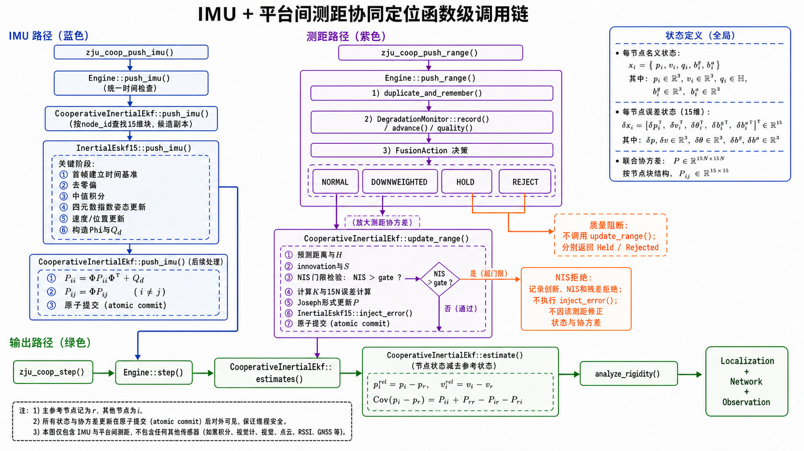

# 原始视觉与点云预留接口说明

## 1. 当前结论

工程已经增加与 ROS 2 `sensor_msgs/msg/Image` 和
`sensor_msgs/msg/PointCloud2` 对应的普通 C ABI 输入结构与函数。

当前版本的边界是：

- 校验节点号、传感器号、序号、统一时间戳、帧名、图像编码和有效状态；
- 校验图像 `step × height == data_size`；
- 校验点云 `row_step × height == data_size`、字段数组跨度和每个字段没有越过
  `point_step`；
- 不复制图像或点云大缓冲，输入指针仅在函数调用期间借用；
- 不调用 `Engine`，不做视觉目标识别、视觉相对观测、点云配准或激光相对观测；
- 不改变现有 IMU＋平台间测距滤波状态；
- 成功回执固定为 `ZJU_COOP_RAW_INPUT_VALIDATED_NOT_USED`，防止把“格式正确”
  误写成“已经融合”。

因此，这一版是正式 ROS 2 wrapper 的接口预留和字段映射检查，不是视觉/激光算法已经完成。

## 2. 新增公开类型和函数

公开声明都位于 `include/zju_coop/c_api.h`，实现位于
`src/api/c_api.cpp`。

| 类别 | 名称 | 作用 |
|---|---|---|
| 点字段 | `zju_coop_point_field_t` | 映射 ROS 2 `PointField` 的名称、偏移、类型和数量 |
| 点云包 | `zju_coop_point_cloud_packet_t` | 映射 `PointCloud2` 的组织方式、字段和原始字节缓冲 |
| 图像包 | `zju_coop_camera_image_packet_t` | 映射 `Image` 的帧、编码、宽高、行跨度和原始字节缓冲 |
| 回执 | `zju_coop_raw_input_result_t` | 回显输入类型、节点、传感器、序号和采样时间 |
| 初始化 | `zju_coop_point_field_init()` | 清零并建立 PointField v1 头部 |
| 初始化 | `zju_coop_point_cloud_packet_init()` | 清零并建立 PointCloud2 映射包 v1 头部 |
| 初始化 | `zju_coop_camera_image_packet_init()` | 清零并建立 Image 映射包 v1 头部 |
| 初始化 | `zju_coop_raw_input_result_init()` | 建立原始输入回执 v1 头部 |
| 输入 | `zju_coop_push_point_cloud()` | 校验点云布局，当前不送入算法 |
| 输入 | `zju_coop_push_camera_image()` | 校验图像布局，当前不送入算法 |

## 3. ROS 2 字段映射

### 3.1 `sensor_msgs/msg/Image`

| ROS 2 字段/适配层数据 | C ABI 字段 |
|---|---|
| 车辆配置 | `node_id` |
| 相机配置 | `camera_id` |
| wrapper 维护的流序号 | `sequence` |
| `header.stamp`转换为统一时间轴纳秒 | `timestamp_ns` |
| 回调开始时采集的同时间域时刻 | `receive_timestamp_ns` |
| `header.frame_id` | `frame_id` |
| `encoding` | `encoding` |
| `height` / `width` / `step` | 同名字段 |
| `is_bigendian` | `is_bigendian` |
| `data.data()` / `data.size()` | `data` / `data_size` |

`data`只在 `zju_coop_push_camera_image()` 调用期间有效。函数返回后，库不会继续
持有该指针，ROS 2 wrapper 可以按正常消息生命周期释放消息。

### 3.2 `sensor_msgs/msg/PointCloud2`

| ROS 2 字段/适配层数据 | C ABI 字段 |
|---|---|
| 车辆配置 | `node_id` |
| 雷达配置 | `sensor_id` |
| wrapper 维护的流序号 | `sequence` |
| `header.stamp`转换为统一时间轴纳秒 | `timestamp_ns` |
| 回调开始时采集的同时间域时刻 | `receive_timestamp_ns` |
| `header.frame_id` | `frame_id` |
| `height` / `width` | 同名字段 |
| 每个 `PointField` | 一个 `zju_coop_point_field_t` |
| `fields.data()` / `fields.size()` | `fields` / `field_count` |
| C结构数组实际步长 | `field_stride` |
| `point_step` / `row_step` | 同名字段 |
| `data.data()` / `data.size()` | `data` / `data_size` |
| `is_bigendian` / `is_dense` | 同名字段 |

`ZJU_COOP_POINT_FIELD_INT8` 至 `ZJU_COOP_POINT_FIELD_FLOAT64` 的数值与
ROS 2 `sensor_msgs/msg/PointField` 的 datatype 1 至 8 保持一致。

## 4. 为什么暂不进入 ZJCL/UDP

图像和点云通常远大于 IMU、测距和定位状态。当前 ZJCL/UDP 是不依赖 ROS 2 的小数据
在线演示协议，不承担原始图像/点云跨平台传输。正式盒端应在同一台 AIBrainBox 内：

```text
ROS 2 驱动消息
  → 上海交大 wrapper
  → 本地 C ABI 校验/未来视觉或点云前端
  → 相对观测
  → 协同定位滤波
```

若未来确实需要远程传图或传点云，应另行选择 ROS 2/DDS、共享内存或专用流媒体/点云
传输方案，并单独规定 QoS、压缩、分片和带宽；不能复用当前小包 UDP 帧硬塞大数据。

## 5. 后续真正接入算法的扩展点

后续取得视觉/激光算法和标定资料后，建议新增“处理后的相对观测”结构，而不是让联合
滤波器直接解析原始像素或点：

- `LiDARRelativeObservationPacket`：`from_node`、`to_node`、相对位姿、
  协方差、`residual_rmse`、`degeneracy_flag`、帧和时间；
- `MultiCameraRelativeObservationPacket`：相对位姿、协方差、`inlier_count`、
  `inlier_ratio`、`reprojection_rmse_px`、帧和时间；
- 独立前端负责图像目标/特征处理和点云配准；
- 质量层负责正常、降权、暂缓和剔除；
- 联合滤波器只消费标准化相对观测。

这能保持“原始传感器前端”和“协同定位核心”解耦，并避免今后更换视觉/激光算法时
重写 IMU＋测距主链。

## 6. 函数级图片







图片用于帮助理解调用层次，接口和行为的最终依据仍是
`include/zju_coop/c_api.h`、`src/api/c_api.cpp`及自动测试。

## 7. 本次自动测试覆盖

`tests/test_c_api.cpp`新增以下测试：

- 合法图像布局可校验，并返回“已校验但未使用”；
- 合法 XYZ `FLOAT32` PointCloud2 布局可校验；
- 错误 `data_size` 被拒绝且回执不发生部分写入；
- 原始图像校验不会冻结后续 `zju_coop_configure_inertial()`；
- `tests/c_header_smoke.c`证明新增头文件和初始化函数仍能由纯 C 编译调用。

